# 2. Rapid Prototyping

Rapid Prototyping turns your exported whiteboard into deployment assets. The deck offers two options. Groups run Option 1, may use Option 2 if they prefer to work in VS Code.

## Option 1: Rapid Prototyping with Cora

Use Cora in the CAIP Technical Workshop Web App to transform a future-state architecture into a working solution prototype — generating the solution accelerator recommendation, Bicep templates, deployment assets, synthetic data, and execution guidance. This is useful for demonstrating how the proposed architecture can be quickly translated into a deployable Sandbox environment.

### How to use it:

1. In the CAIP Technical Workshop Web App, upload your future-state architecture image (or the reference architecture as a backup) to Cora, with a natural-language prompt describing it.
1. Ask Cora to explain the architecture and recommend a solution accelerator.
1. Generate the Bicep template, deployment assets, synthetic data, and an execution guide.
1. Download the assets and open them in VS Code to review with GitHub Copilot.
1. Validate the assets, then deploy to the sandbox.
1. Review the deployed environment and confirm your business challenges are addressed.


### Steps: Access the Cloud & AI Platform Technical Workshops web application

### `Steps to navigate to CAIP Tech Workshop Web App.`

1. Click on the **Microsoft Edge** from the Lab VM desktop.
   
   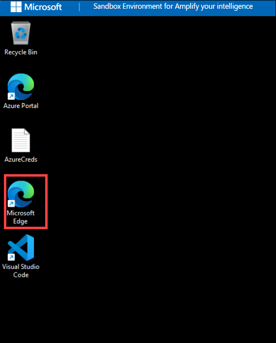
   
1. Right click on [Cloud & AI Platform Technical Workshops](https://caip-tech-workshops.azurewebsites.net/), then select **Copy link** and then paste the link on the Web browser.

1. Login with the following credentials:

    - Username: **<inject key="AzureAdUserEmail"></inject>**
    - Password: **<inject key="AzureAdUserPassword"></inject>**

1. After the application loads, you will see the workshop site home page as shown below.

   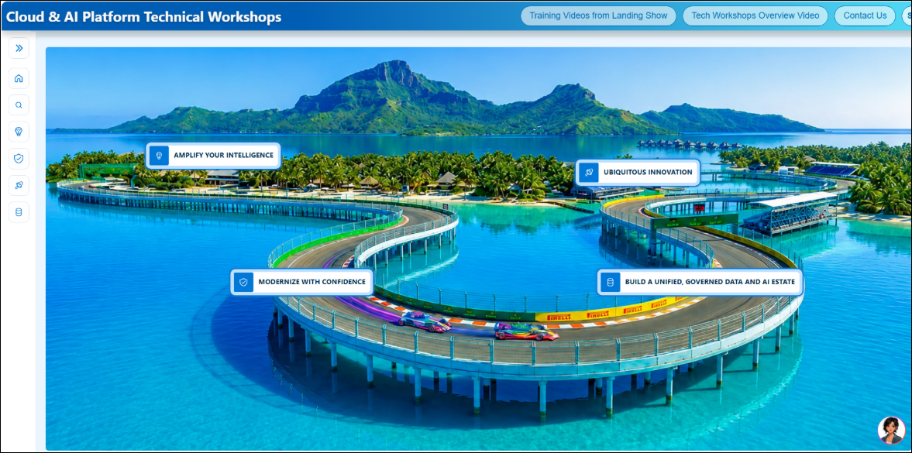

1. Select the **Modernize with confidence** to explore the available outcomes and workshop scenarios.

   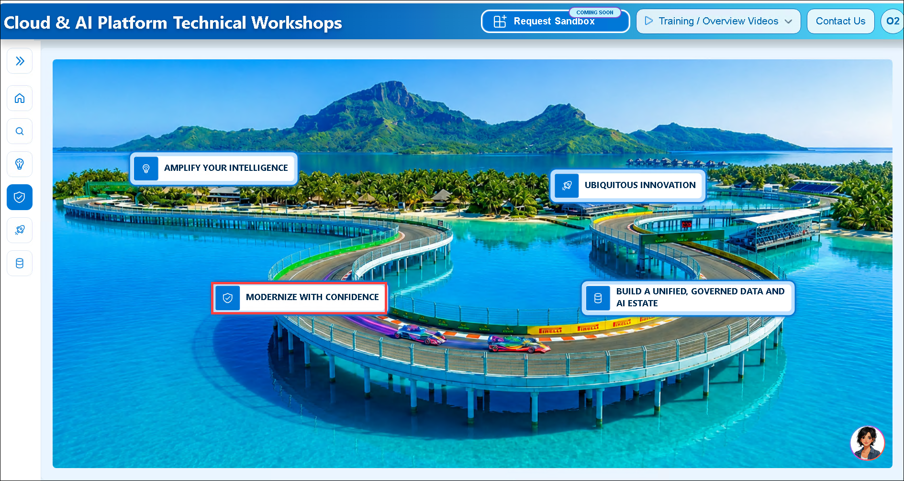

1. On the right side of the page, you'll find **Cora**, the AI-Powered Rapid Prototyping Copilot. Use the chat interface to enter prompts and interact with the workshop outcomes and scenarios as follows:

   - From the left navigation pane, under **Outcomes**, select **Modernize Faster with Agentic AI (1)**.
   - Under **Scenarios**, select **Agentic App & Databases Modernization (2)**.
   - In the **Technical Workshops** section, expand **Prototype using Cora (3)** and select **Cora (Preview) for Roadshows (4)**.
   
     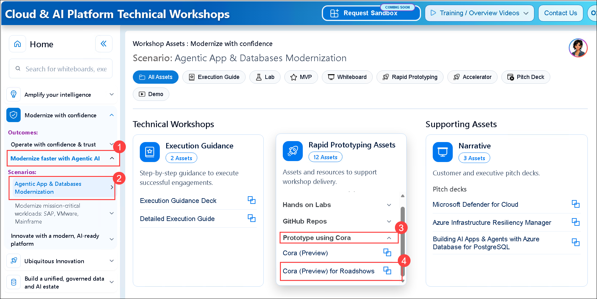

1. Continue in the **Cora Chat** pane for **Rapid Prototyping**.  

   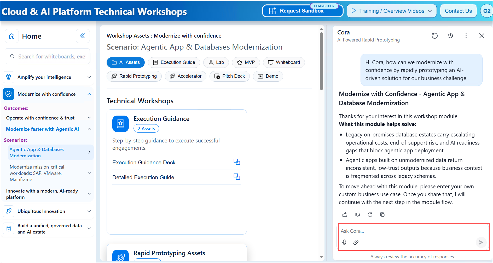

1. In Cora chat pane, copy and paste the following business problem statement to Cora. 

   ```
   My customer Caldova is a pharmaceutical manufacturer who plans to launch their new V2 product. I have three comments 

   1) Caldova’s supply chain planning application runs on legacy .NET, the manufacturing database sits on an on-premises SQL Server. It’s Data remains siloed across IoT, supply chain, customer, production, supplier, and manufacturing systems. Recommend a solution to migrate the on-premises SQL Server to Azure SQL DB. 

   2) Also, Caldova currently can manufacture 100 million units in 6 months. It needs to ensure the ability to manufacture 107 million units in 6 months, a gap of 7% manufacturing capacity. The closure of the 7% capacity gap across three manufacturing plants is needed to support the upcoming V2 product across multiple plants. Caldova needs to understand whether it can close the gap internally, and if not, which pre-qualified contract manufacturing organizations can fast-track support in a 3–6-month window. 

   3) They want an AI-powered multi-agent solution using Microsoft Fabric and Microsoft Foundry to identify internal improvements to their manufacturing plants as well as recommend contract manufacturing orgs to achieve the desired production capacity.
   ```

1. From the Cora chat, select the Attach file **(1)** icon, then navigate to `C:\miq-project` folder **(2)**, select the name as **Future-State-Architecture (3)** and then **Open (4)**.

   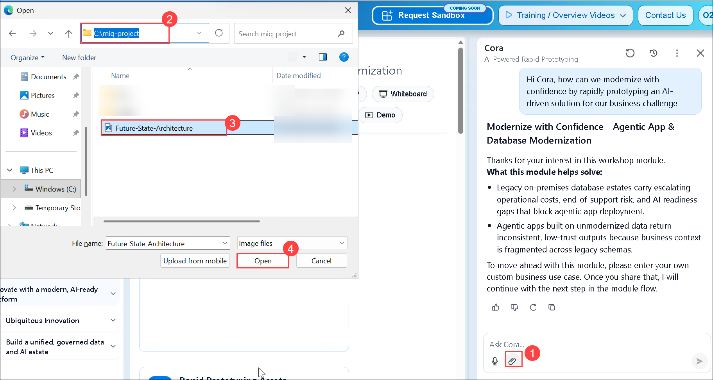 

1. Along with the final `Future State Architecture` screenshot from `C:\miq-project` folder and copy & paste the following statement on Cora. 

   ```
   Explain this Architecture.
   ``` 

   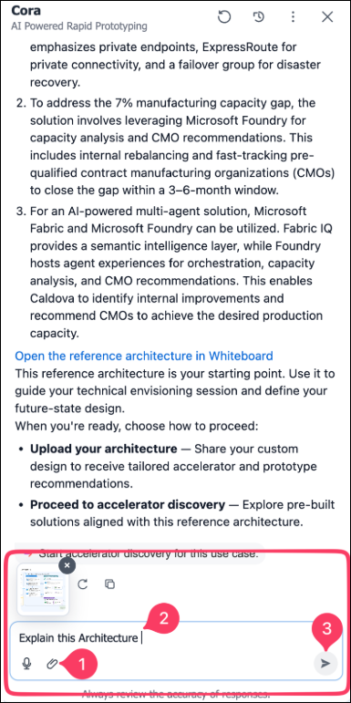   

1. Review the Architecture Summary provided by Cora.

   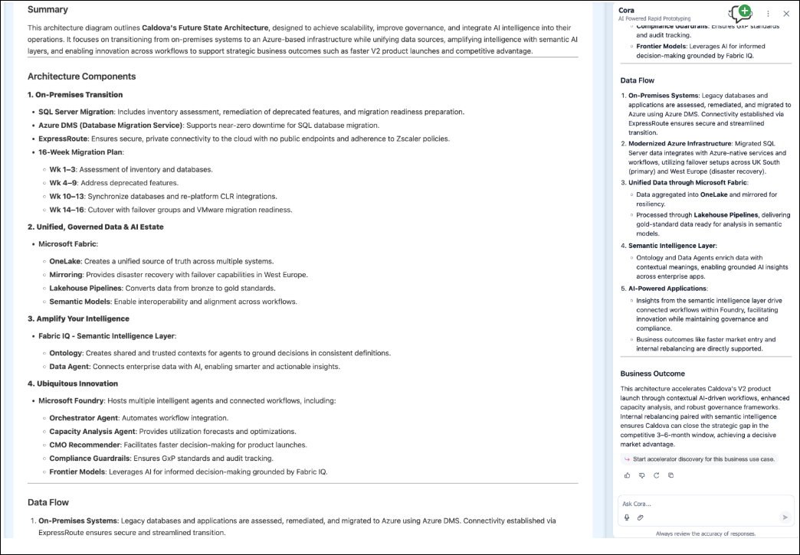   

1. **Copy & paste** the following statement on Cora.

   ```
   Generate Synthetic Data
   ```

   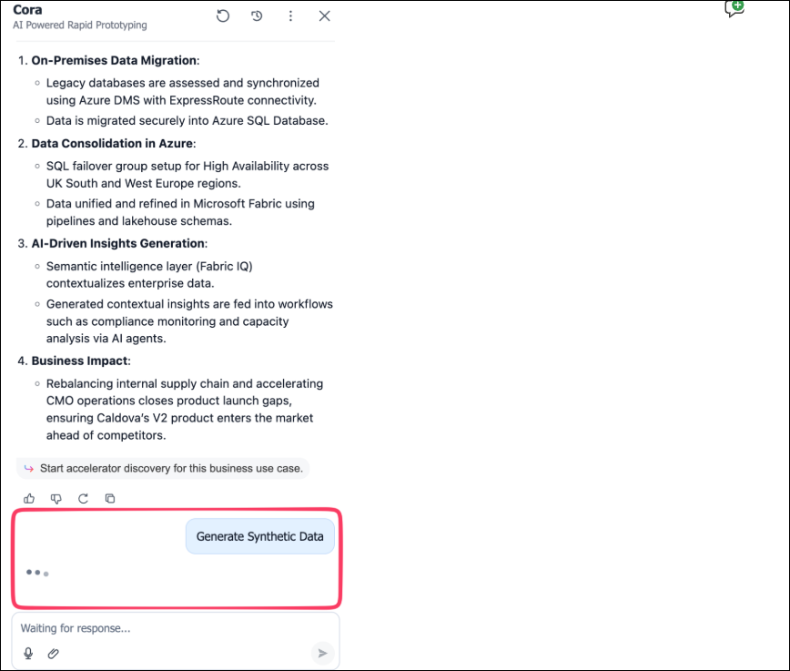  

    >**Note:** It might take 2-3 minutes to generate the data.

1. Review the tables from the generated data and click on **Download full artifacts.**      

   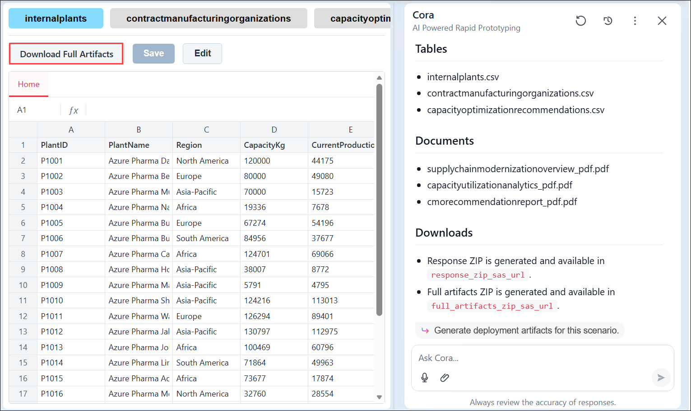  

1. Copy and paste the following prompt on Cora: 

   ```
   Generate the deployment artifacts using this Architecture.
   ```

   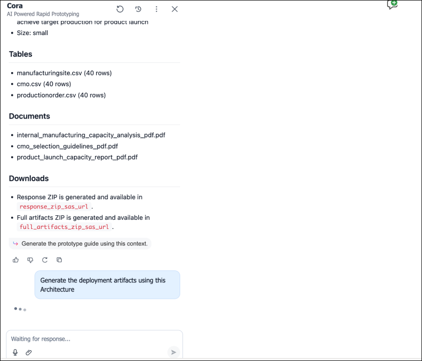 

    >**Note:** It might take 1-2 minutes to generate the Deployment artifacts

1. Review the generated files from the Cora and click on **Download** to download the zip file on top left. 

   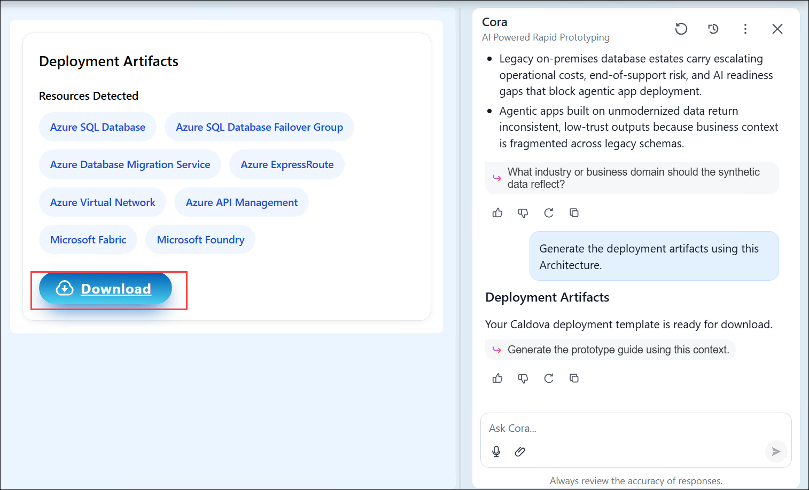 

1. Save the Downloaded zip file in your preferred location.   

   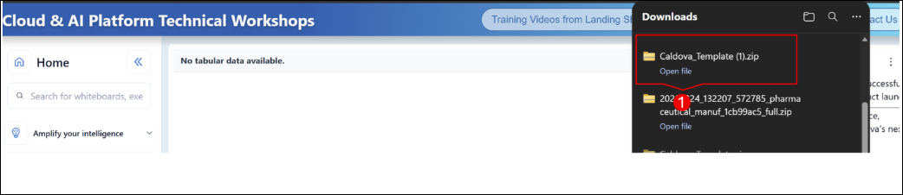

1. Click on the prompt `Generate the prototype guide using this context`. It will generate the Exercises in the left. 

   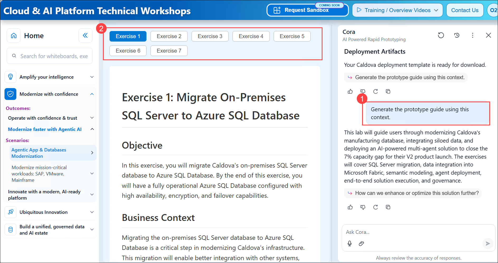


## This completes the Rapid Prototyping using Cora.

### Now, click on **`Next >>`** from the lower right corner to experience **`Rapid Prototyping using GitHub Copilot`**.
