# Option 2: Rapid Prototyping with GitHub Copilot

Option 2 uses the Whiteboarding session to map business challenges to a future-state technical architecture, designs a governed intelligence layer that enables trusted and secure AI agents, and rapidly prototypes deployment assets from the target architecture. GitHub Copilot in VS Code generates the ARM and Bicep templates, synthetic data and the supporting deployment guidance. Use this path to demonstrate how Microsoft Fabric, Fabric IQ, Microsoft Foundry and multi-agent patterns address Caldova's operational challenges and accelerate modernization. 

### GitHub Copilot role in the Workshop

Use GitHub Copilot to accelerate the creation, validation, and refinement of deployment assets. Copilot should help participants:

- Convert architecture decisions into deployable infrastructure definitions.
- Generate ARM/Bicep templates.
- Create supporting parameter files.
- Review dependencies and deployment sequencing.
- Explain template sections and resource relationships.
- Identify missing networking, identity, monitoring, or security configuration.
- Produce deployment instructions for the sandbox environment.

### Upload Future State Architecture and Generate ARM/Bicep Template in VS Code

Follow these steps in VS Code:

1. Open the workshop repository or sandbox folder in VS Code.
1. Add the exported future-state architecture image to the folder.
1. Open GitHub Copilot Chat in VS Code.
1. Attach or reference the future-state architecture image.
1. Ask Copilot to analyze the architecture and identify the Azure resources required.
1. Ask Copilot to generate an ARM or Bicep template based on the architecture.
1. Ask Copilot to create a parameter file for the sandbox deployment.
1. Ask Copilot to validate dependencies, naming conventions, and resource group assumptions.
1. Review the generated files before deployment.

### GitHub Copilot Setup

You will use GitHub Copilot to generate ARM or Bicep templates from the provided natural language business use case/scenario.

1. Click on the **Visual Studio Code** from the VM desktop.

   

1. Click on **Continue with GitHub** to sign in to GitHub Copilot.

   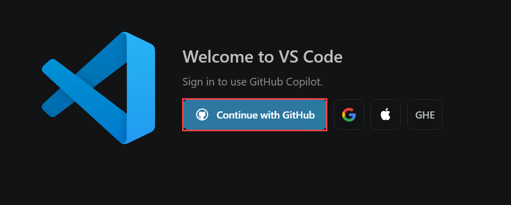

1. On the **Sign in to GitHub** tab, enter the provided **GitHub username** **(1)** in the input field, and click on **Sign in with your identity provider** to continue **(2)**.

   - **Username:** <inject key="GitHub User Name" enableCopy="true"/>

     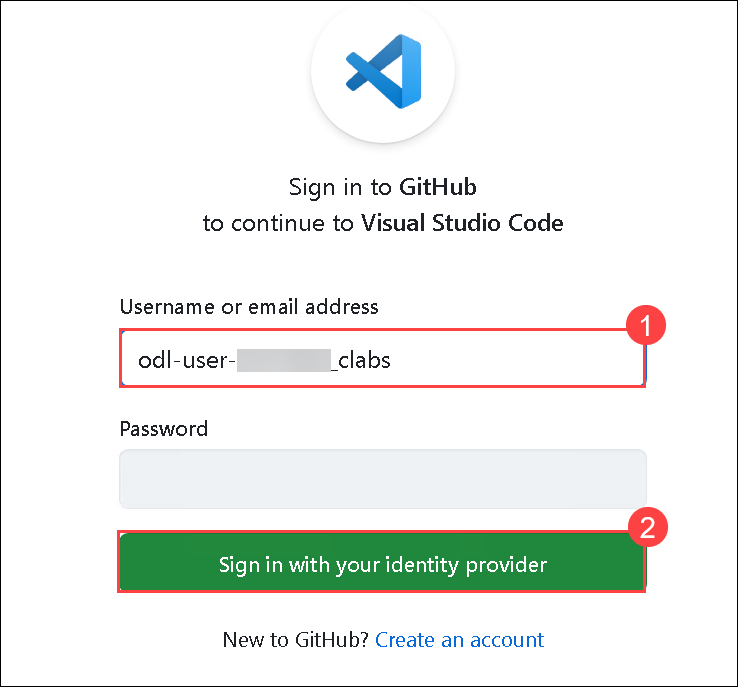

1. Click on **Continue** on the **Single sign-on to CloudLabs Organizations** page to proceed.

   

1. Click on **Accept**.

   

1. Select **Continue** to **Authorize Visual Studio Code**.

   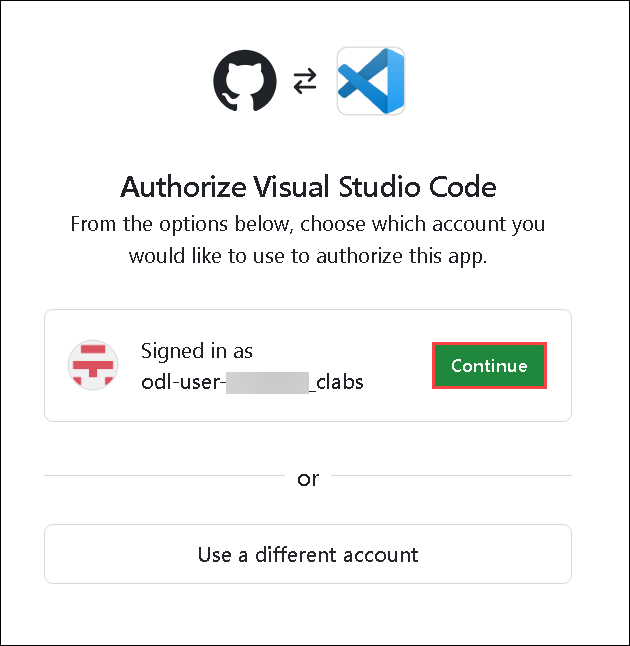

1. Select **Authorize Visual Studio Code**.

   

1. Select **Open**.

   

1. Once the Visual Studio code opens, choose the theme of your wish **(1)** and then click **Get Started (2)**.

   

   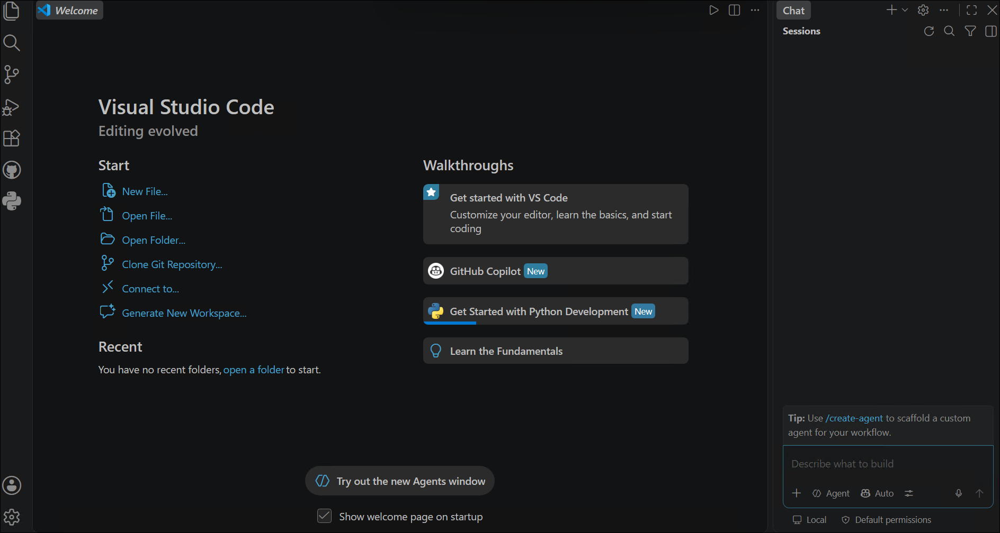

   >**Note:** If you get any error pop up, please **Close.**

    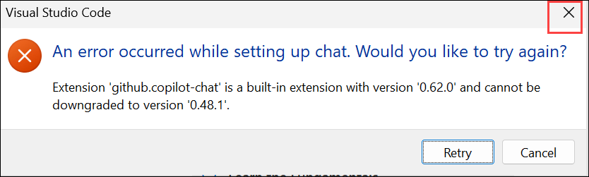


### Caldova Deployment Prompts

#### **Prompt 1: Azure SQL Database**

1. Navigate back to **VS Code.**

1. Select **File (1)** and then **Open Folder (2)**.

   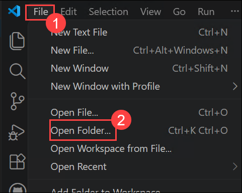

1. Navigate to **`C:\miq-project`** path **(1)** and then **Select folder (2)**.

   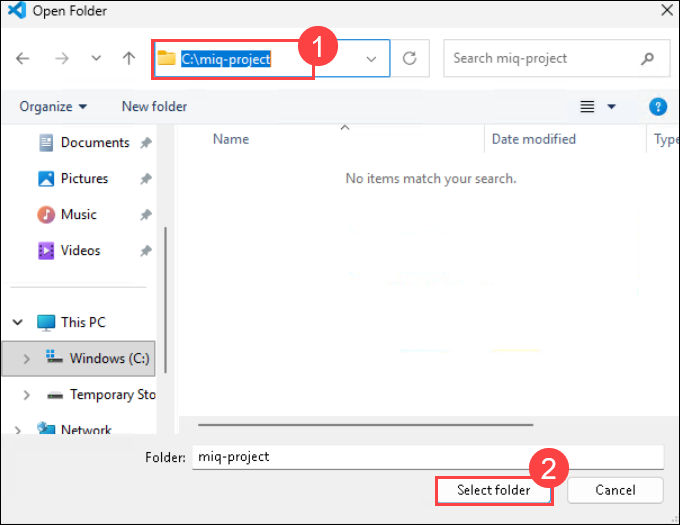

1. From the **GitHub Copilot** Chat, select **Models (1)** and then select **Trust Workspace to enable models (2)**.

   

1. Select **Trust Folder and Continue**.

   

1. Click **Auto (1)** and then set the model to **Claude Sonnet 5 (2)**.

   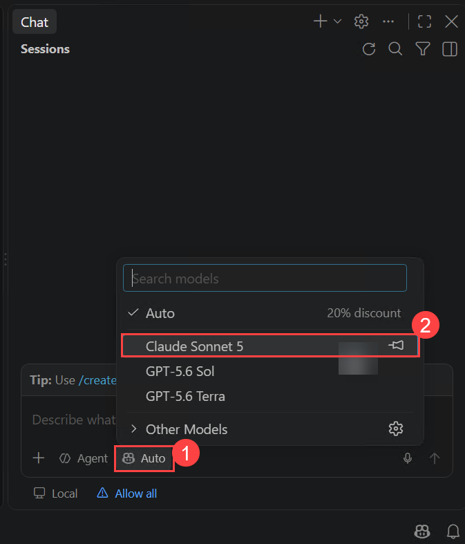

1. Click on **Default permission (1)** and then set it to **Allow all (2)**.

   

1. Select **Enable**.

   

1. Select the **Future-State-Architecture.png**.

   

1. From the **GitHub Copilot Chat**, click on **+ (1)** and then select the **Future-State-Architecture.png (2)**.

   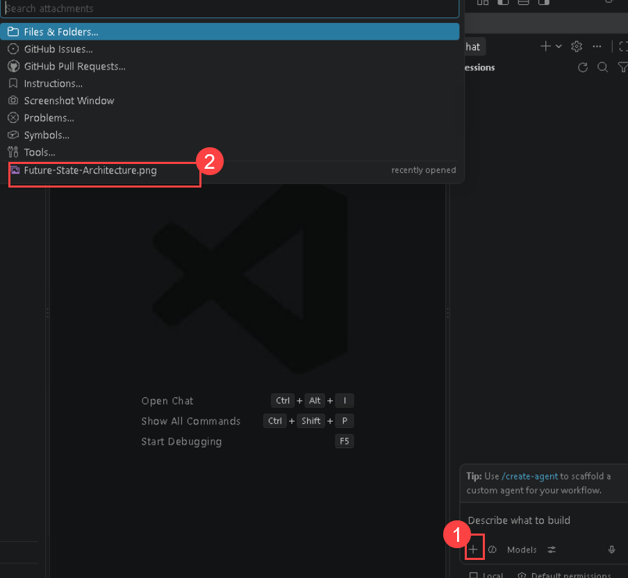   

1. Send the prompts below into **GitHub Copilot Chat** along with the attached **Future State Architecture**.

   ```
   You are my smart agent. Please migrate OnPrem SQL database to Azure SQL database. Please follow the below steps.
   Planned Solution Architecture Design:Attached Future-State-Archirecture.png.
   Scope:
   First, build the **"1-Modernize with Confidence"** section from the planned solution architecture design using **Azure SQL Database**.
   Instructions:
   1. Create a new Resource Group naming as "RG_Caldova_Pharma" in Azure in the region of "West US3" and proceed further.
   2. Create an Azure SQL server and one Azure SQL Database on that server, as shown in the architecture diagram (Business Critical tier, TDE enabled).
   3. Enable the system-assigned managed identity on the logical server and allow Azure services and resources to access the server. This is required for Fabric mirroring in the next phase.
   4. Connect to the virtual machine named vm-onprem-sql (Public IP: 172.172.65.25) using credentials (User name: azureuser, password: Password@123) . 
   5. Connect and Access the OnPrem SQL Sever using credentials
      - User Name: sqladmin
      - Password: admin@12345
   6. Access database "CaldovaPharma" in this OnPrem server.
   7. Migrate Tables and data into the created Azure SQL Database
   8. Please grant set as admin access to the UPN: <inject key="AzureAdUserEmail"></inject> in the above Azure SQL Server

   Note: Ensure the data is properly relational, with a primary key on every table and explicit foreign key relationship, so it can support Fabric mirroring, Fabric Ontology, and Data Agent creation in the future. Also create markdown(.md) files with deployment instructions and post deployment configurations and start deployment.
   ```

    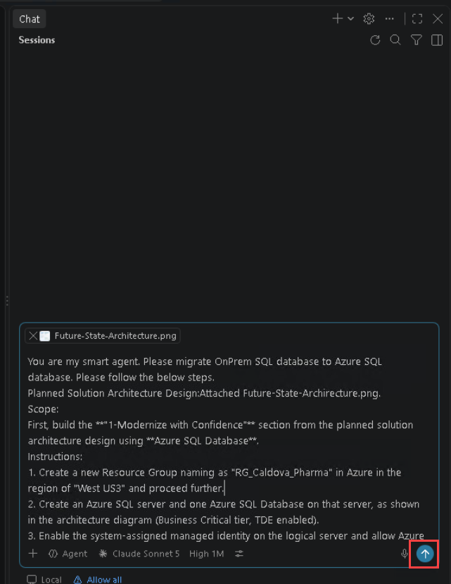

1. Once the deployment starts, you may be prompted to log in. Click the **Login link (1)** and copy the device code **(2)**.

   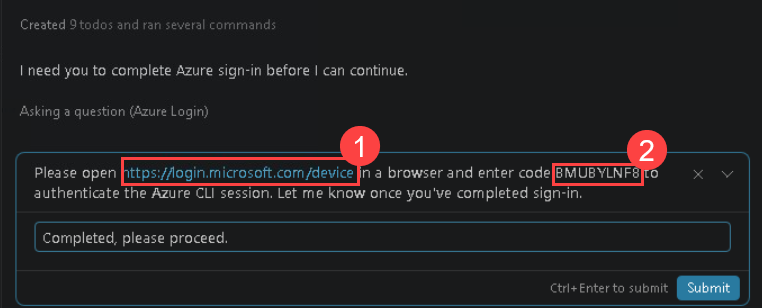

1. Paste the copied Code **(1)** and then **Next (2)**.

   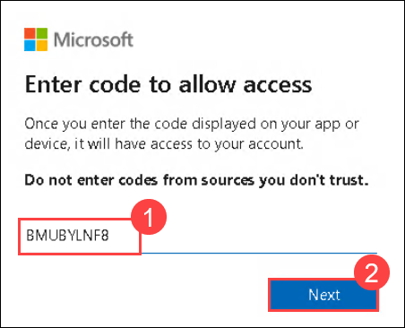

1. Select the Username **<inject key="AzureAdUserEmail"></inject>**.

   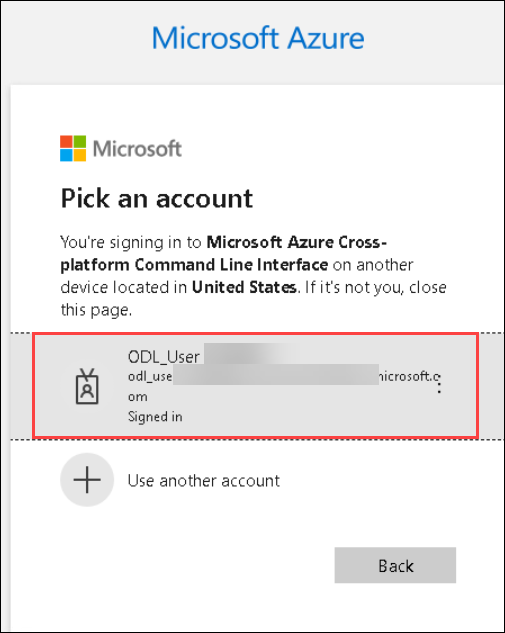

1. Select **Continue**.

   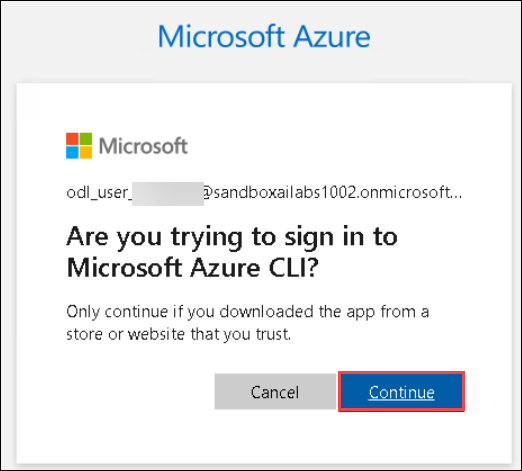

1. Once the Sign in is completed, go back to the **Visual Studio Code.**

   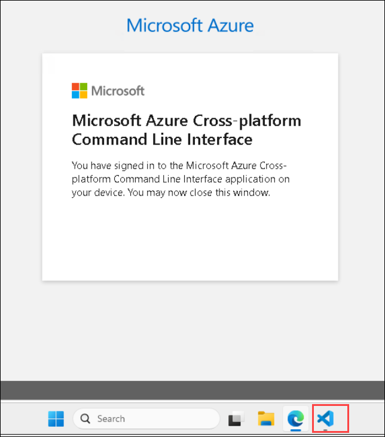

1. Select **Done, signed in**.   

   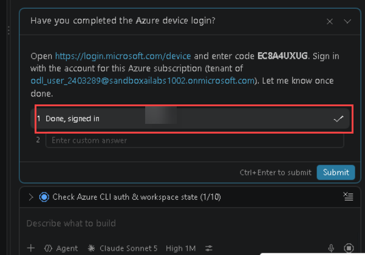

1. Post completion of the login, Copilot starts generating the response, monitor the process closely. Do not take any action; simply watch the progress.   

1. In between, if it asks you to **Continue to iterate**, please click **Continue**.

   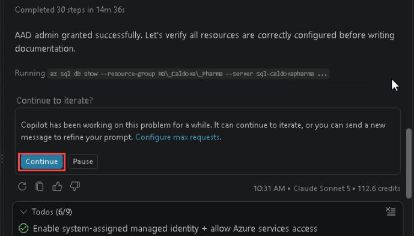

1. The deployment may take around 5–10 minutes, and in some cases, it may take longer to complete. Once the deployment is completed, you may see a response similar to the one shown below. Click **Keep** to retain the files.

   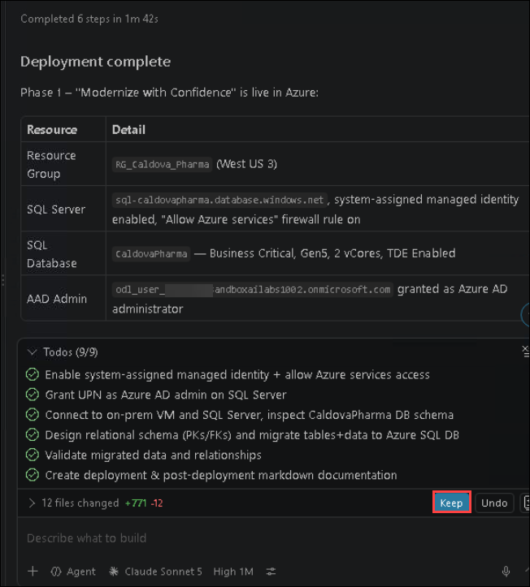

1. Once the deployment is complete, you can verify the deployed resources by navigating to the newly created resource group.

1. Navigate to the [Azure portal](https://portal.azure.com).

1. Search for **Resource groups (1)** in search tab and click on **Resource Groups (2)**.

   

1. Click on **RG_Caldova_Pharma** Resource Group
    
   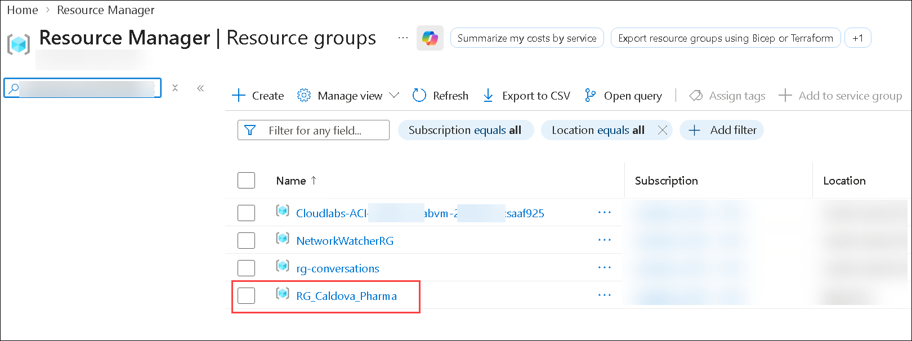

1. Click on created SQLDatabase **CaldovaPharma**.

   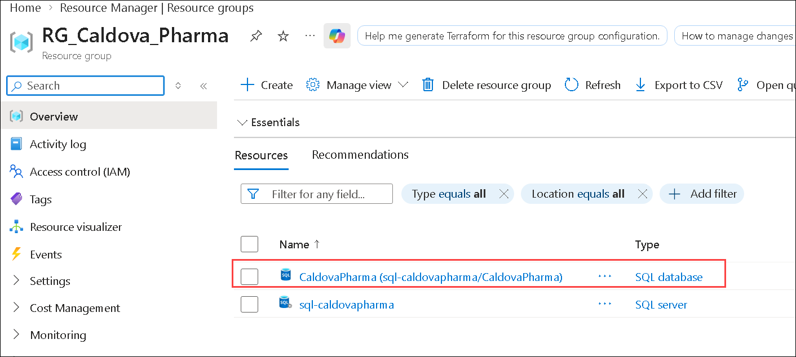

1. In the left navigation pane, select **Query Editor (Preview) (1)** and then click on Connect as **odl_user_<inject key="Deployment-ID" enableCopy="false"/> (2)**.

   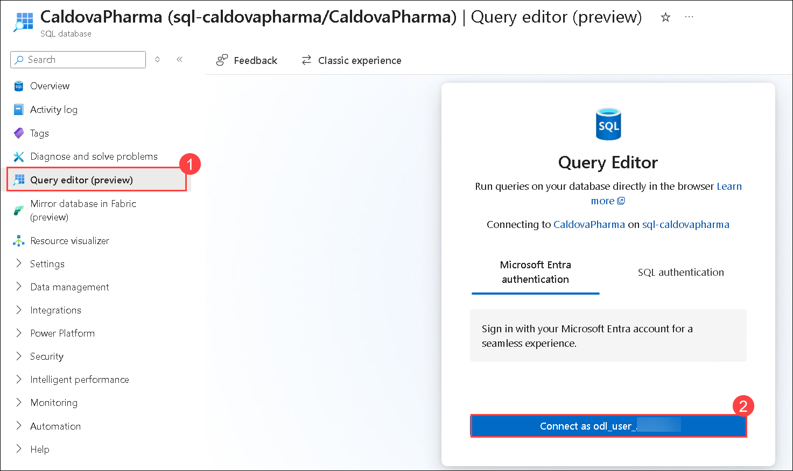

1. In the Explorer pane, expand **CaldovaPharma** DB , then expand **dbo (1)** and then expand **Tables (2)**. Click on the Tables to view the list of tables in the database **(3)**.

   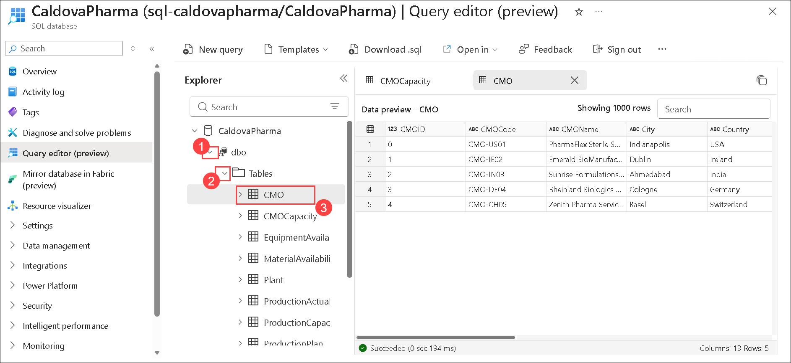


#### **Prompt 2: Fabric IQ**

**Step 2:** 
1. Navigate back to **VS Code** again.

1. Copy the prompts below into **GitHub Copilot**.

   ```
   Great, you have created Azure SQL Server and Database. Now follow the instructions below to build **Fabric IQ**.
   Note: Please use same Resource Group as "RG_Caldova_Pharma" for all the below resources.
   
   Instructions:
   1. List all Azure resources from the architecture diagram.
   2. Create a new Fabric Capacity using **SKU F16** for the **West US 3** region.
   3. Create a new Fabric Workspace attaching with above newly created capacity.
   4. Please grant admin access to the UPN: <inject key="AzureAdUserEmail"></inject> in the Fabric Workspace 
   5. Create a Lakehouse and load tables from the Azure SQL Database using Fabric mirroring (Mirrored Azure SQL Database).
   6. Create a Fabric Ontology using the Lakehouse tables with proper relationships and generate the Ontology Graph view.
   7. Create a Data Agent using the Ontology as a data source, and prepare proper Agent Instructions based on the Ontology entities to support the business problem.
   Completion Requirement:
   
   After completing the steps successfully, create a Markdown file with:
   - Deployment instructions
   - Deployment startup steps for:
   - Creating the workspace
   - Creating the Lakehouse
   - Loading data from Azure SQL Database into Lakehouse using mirroring
   - Creating the Ontology
   - Creating the Data Agent
   - Post-deployment configurations
   Then start deploying.
   ```

    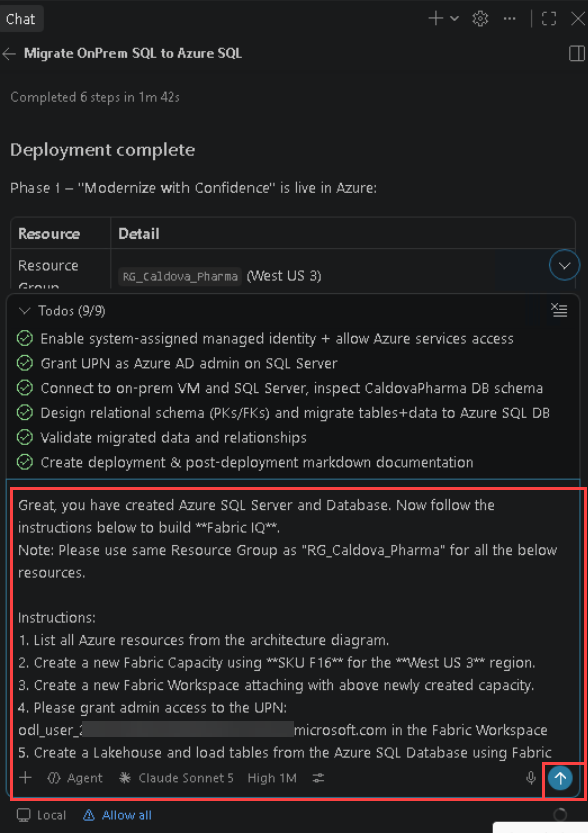   

1. Copilot starts generating the response, monitor the process closely. Do not take any action; simply watch the progress. If prompted with any questions, provide the appropriate responses accordingly.

1. In between, if it asks you to **Continue to iterate**, please click **Continue**.

   

1. The deployment may take around `40-50` minutes, monitor the process closely. Once the deployment is completed, you may see a response similar to the one shown below. Click **Keep** to retain the files.

   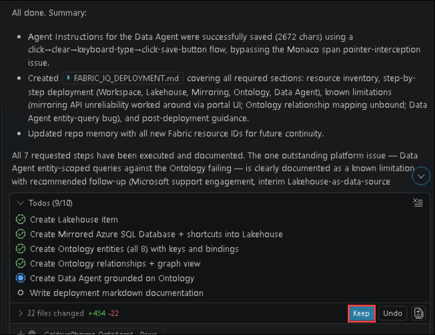

1. Once deployment is completed, please navigate back to **Azure Portal**.

1. Click on the **App launcher (1)** and select Microsoft **fabric** icon **(2)**.

    

1. It will open **Fabric Portal** in new tab.

1. Click **Workspaces (1)** and select the workspace with a name similar to **Caldova Pharma Fabric (2)**.

   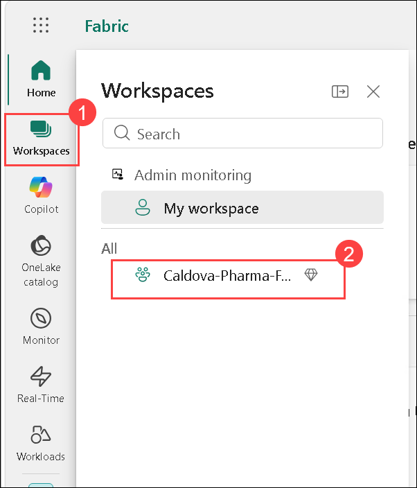

1. View the Items created in the Fabric Workspace.

   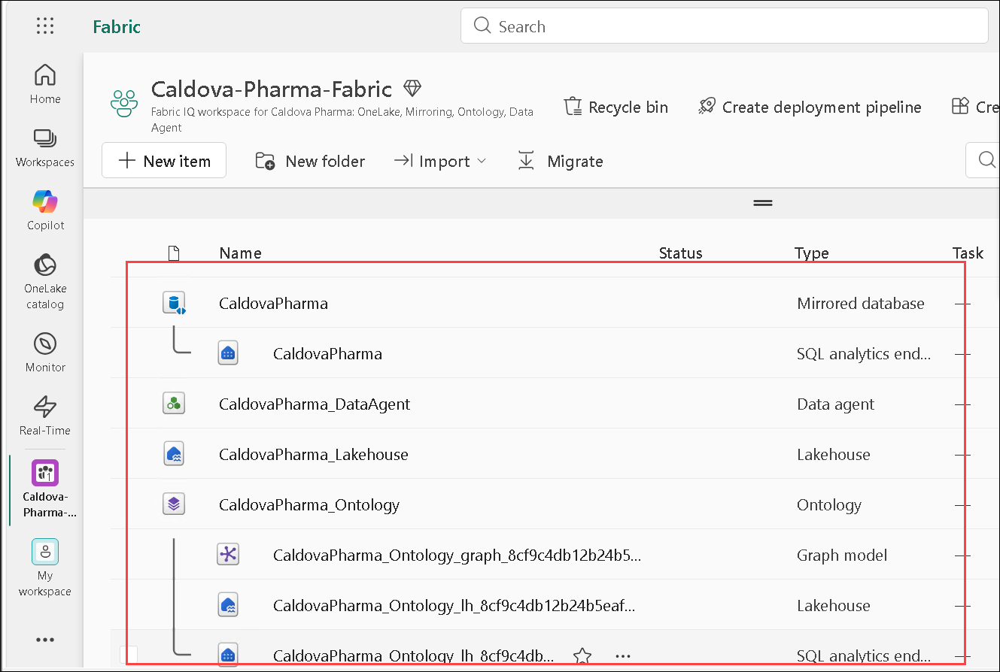

1. Click on **CaldovaPharma_Lakehouse** 

   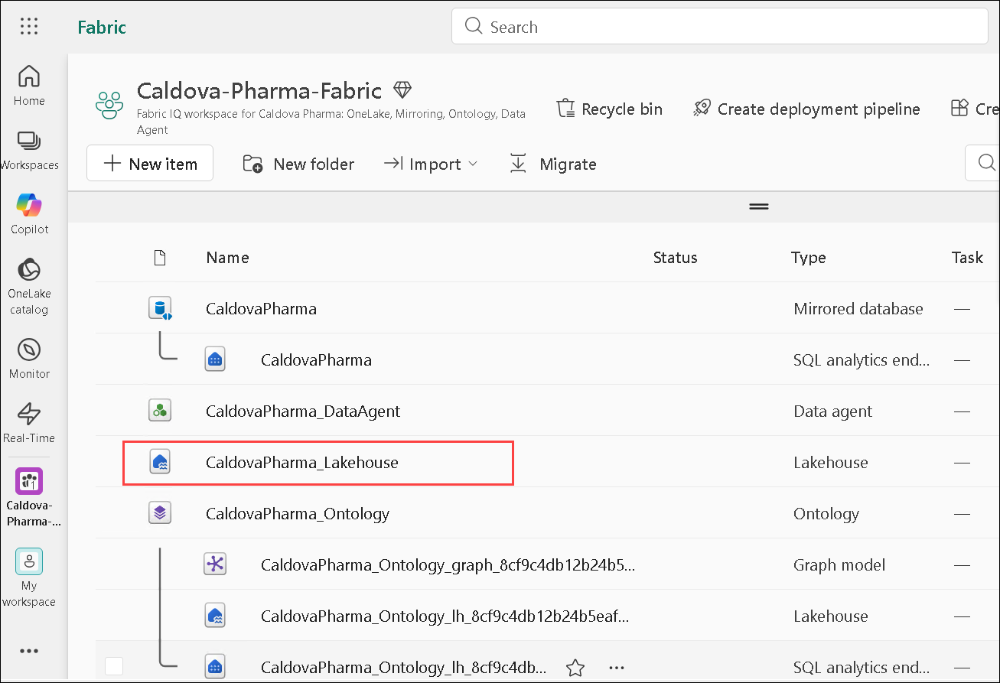

1. Select Tables to view the list of tables in the Lakehouse.

   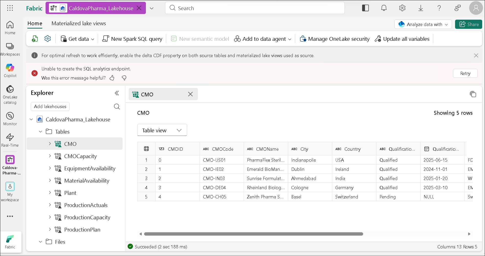

1. Make sure the tables are loaded properly.

   - If the Tables are not loaded properly, then go back to the **GitHub Copilot Chat** and then send the follow up prompt as below.

      ```
      Please follow the below instructions:
      1. Lakehouse tables are not loaded properly. Please load it again from Azure SQL Database using mirroring and mirroring DB.
      2. Once Lakehouse table loaded, please build ontology pointing to Lakehouse tables and create Ontology graph and proper entity relationship.
      3. Create Fabric Data Agent point to above Fabric Ontology.
      4.Validate all 3 and confirm once all are up and running.
      ```

      - Once the deployment is completed, go back to the lakehouse and verfify the tables.

1. Navigate back to the Workspace, then Click on **CaldovaPharma_Ontology**.

   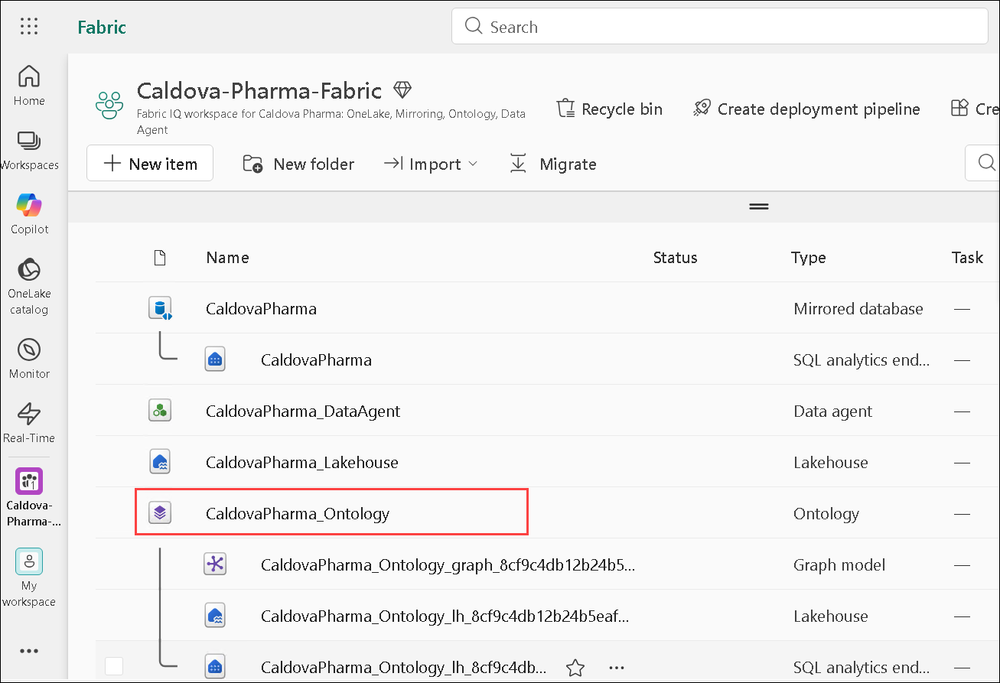

1. Then Select **CMOCapacity (1)** in the Entity Types and Click on **View Entity Type Details (2)**.

   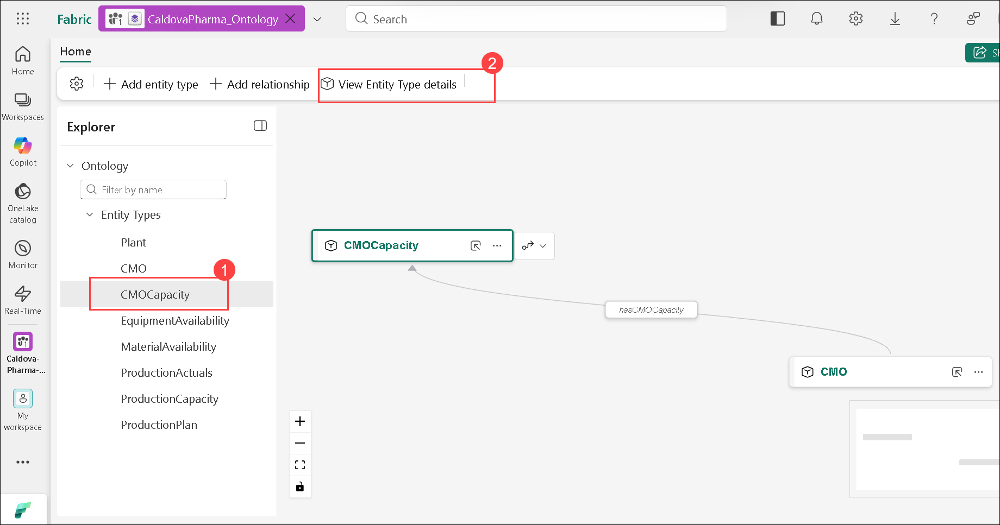

1. Click on **Overview** to view the graph model. You can see something similar to this.

   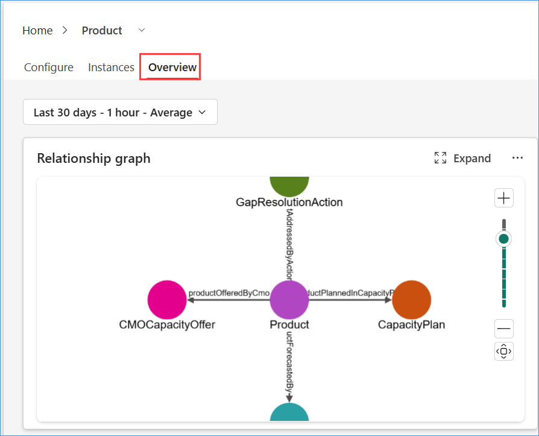

1. Navigate back to workspace and Click on **CaldovaPharma_Dataagent**.

   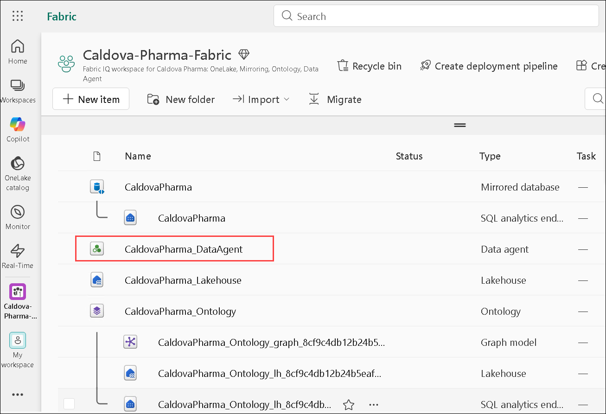

1. Make sure Ontology is added as a data source.

   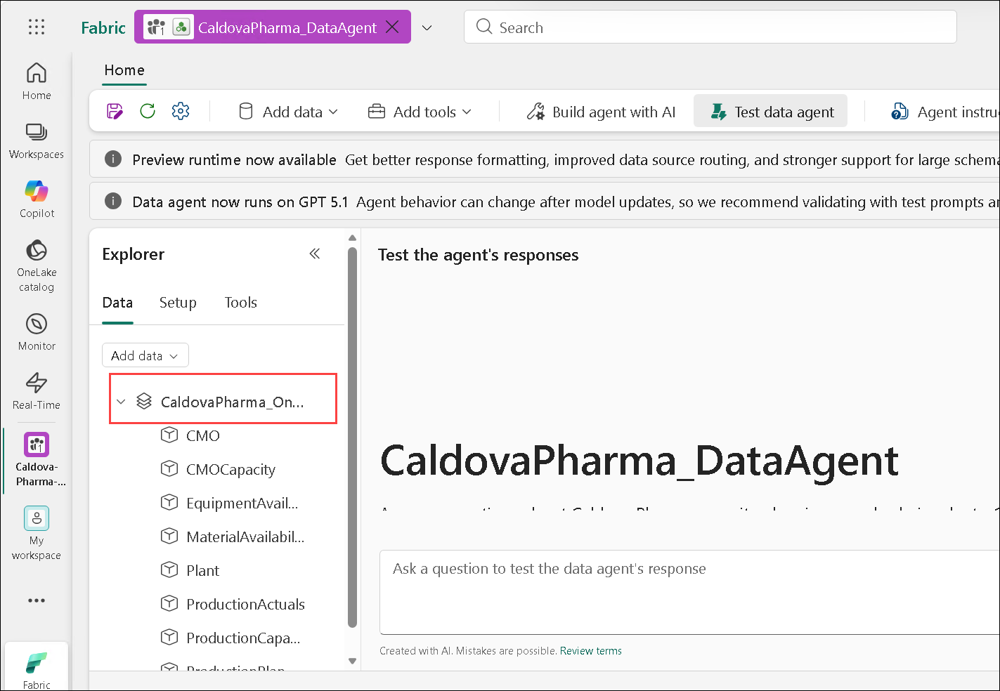

1. Navigate to Test data agent, send the following prompts in Data agent input box. 

   ```
   What CMO capacity offers are currently available?
   ```

   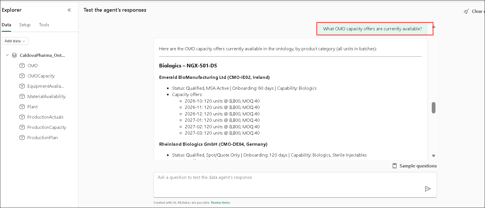

   ```
   Are there any products where forecasted demand exceeds available production capacity?
   ```

   ```
   Which capacity gaps have been identified, and what actions have been recommended to resolve them?
   ```

1. If the Data agent is not responding, then go back to the **GitHub Copilot Chat**, send the follow up prompt as per your requirement.

   ```
   Data agent is unable to fetch information from Ontology. Looks like ontology is not yet bulit propely with proper graph model (Entity relationship). Can you please rebuild my ontology with proper Entity relationship and refreh my data agent with pointing Ontology.
   ```

    >**Note:** You can also paste the screenshot in the Copilot Chat.

1. Click on **Publish** to publish the DataAgent.

   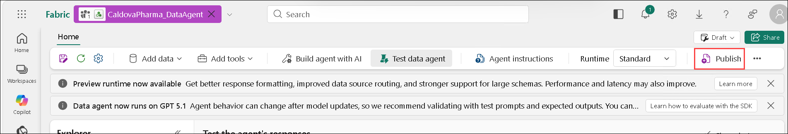

1. Select **Publish** again.   

#### **Prompt 3: Foundry IQ**

**Step 3:** 

1. Navigate back to the **GitHub Copilot Chat** to deploy the Foundry resources.

1. Copy the below prompt into the chat and send.

   ```
   Great, you have created both Azure SQL Database and Fabric IQ. Now follow the instructions below to build **Foundry IQ**.
   
   Note: Please use same Resource Group as "RG_Caldova_Pharma" for all the below resources.
   
   Instructions
   1. List all Azure Foundry-related resources from the architecture diagram.
   2. Create Foundry resources in Azure.
   3. In the Foundry Project, create one standard model: **gpt-5-mini**. Set the model deployment capacity to 90K TPM.
   4. Grant the Foundry project's managed identity the Foundry User role, scoped to the Foundry project, so it can access project resources such as datasets and connected data sources. Verify this role assignment is active before proceeding.
   5. In the Foundry Project, create an agent named **Capacity-Planning-Foundry-Agent** and attach the Fabric Data Agent, **Capacity-Planning-Agent**, by tool calling.
   6. Create proper instructions for the agent so it provides useful responses.
   7. Once **Capacity-Planning-Foundry-Agent** is created, validate that the prompt works and returns valid results, then provide confirmation.
   8. Ensure the agent instruction, prompt, and response fulfill the problem statement.
   Completion Requirement: 
   After completing all steps successfully, create a Markdown file with:
   - Deployment instructions
   - Post-deployment configurations
   Then start deployment.
   ```

1. Once deployment is completed, please navigate to **Azure portal**.

1. Navigate to **RG_Caldova_Pharma** Resource Group.

1. Select **Foundry Project**.

   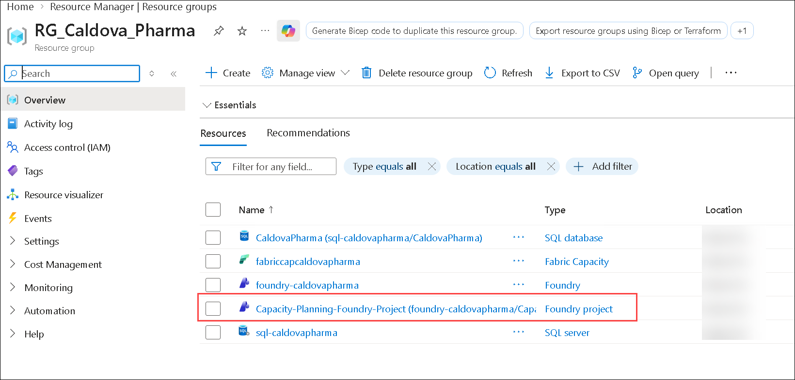

1. Click On **Go to Foundry portal**.

   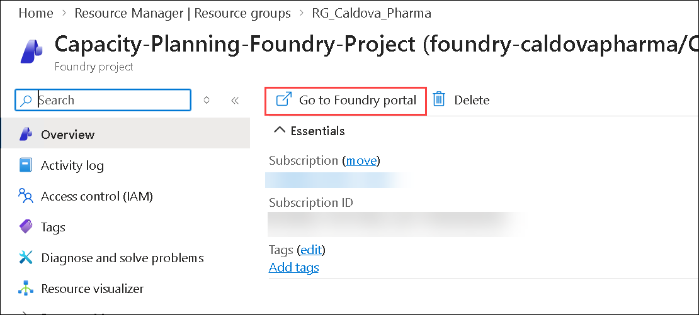

1. Click on **Build.**

1. Navigate to **Agents (1)** and click on the **Capacity-Planning-Foundry-Agent (2)**.

   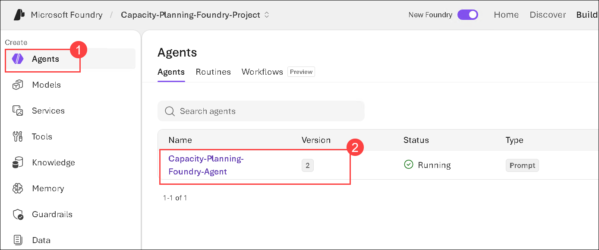

   >**Note:** If the agent is not visible, use this prompt, go back to the GitHub Copilot Chat and send the following promot.

   ```
   Not able to see agent, please refresh and load it.
   ```

1. Copy the below prompts and paste it in the agent chat window 

   ```
   Assess the real-time line, shift, and batch-schedule data from all three plants to recommend 7% capacity gap closure. If the entire gap cannot be closed internally, assess all 11 contract manufacturers and weigh their qualification status, GMP compliance history, available capacity, tech-transfer time, and cost to fully close the 7% capacity gap.
   ```

   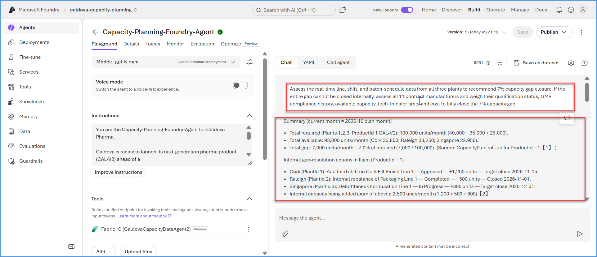


   ```
   Evaluate the impact of a 10% increase in forecasted demand across the product portfolio on current plant and production-line capacity. Identify the products and production lines that would create the largest capacity gaps, quantify the gap for each product and plant, and determine whether each gap can be absorbed using available internal capacity or requires additional CMO capacity. Present the results visually, including a ranked view of the largest capacity gaps, a comparison of demand versus available capacity by plant, and a clear breakdown of internal versus CMO capacity required. Highlight the highest-priority gaps and provide recommended actions for each
   ```
   

   >**Note:** Treat generated templates as a rapid prototype starting point. Teams must validate resource availability, region support, security settings, and workshop sandbox constraints before deployment.


### Congratulations, this completes your Rapid Prototyping with GitHub Copilot